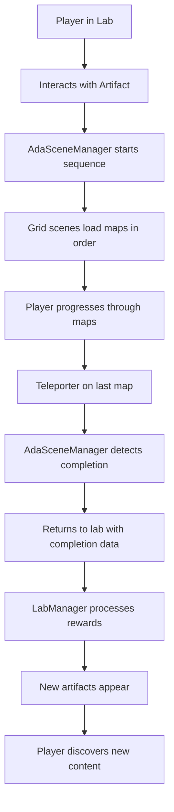

# Lab Progression System - Complete Implementation Guide

## Executive Overview

This document describes the **Lab Progression System**, a sophisticated yet elegant solution that transforms the VR learning environment into a dynamic, reward-driven experience. The system automatically reveals new interactive artifacts in the lab as players complete learning sequences, creating a tangible sense of progression and achievement.

**What makes this special:** Instead of a static lab environment, players return from each completed sequence to discover new mysterious objects have appeared on their lab table. These artifacts serve dual purposes—they're both rewards celebrating past achievements and gateways to unlock future learning paths. The entire system is JSON-driven, making it highly configurable without code changes, and uses a clean component architecture that separates concerns while maintaining seamless integration.

The implementation leverages Godot's scene system, JSON configuration files, and a sophisticated state management approach that persists progression across sessions. Players experience a living, evolving laboratory that grows more rich and interesting with each sequence they master.

---

## System Architecture

### Core Components

#### **1. AdaSceneManager** (`res://commons/managers/AdaSceneManager.gd`)
- **Purpose**: Universal scene transition manager with progression awareness
- **Key Features**:
  - Manages transitions between lab and sequence scenes
  - Tracks sequence completion and carries completion data
  - Automatically notifies lab when sequences finish
  - JSON-driven sequence configuration
  - Singleton pattern for global access

#### **2. Enhanced LabManager** (`res://commons/managers/LabManager.gd`)
- **Purpose**: Dynamic artifact spawning and lab state management
- **Key Features**:
  - Loads artifacts based on progression state
  - Handles sequence completion notifications
  - Manages visual effects and lighting changes
  - Persists progression across sessions
  - JSON-driven artifact definitions

#### **3. JSON Configuration System**
- **lab_artifacts.json**: Defines physical artifacts and their properties
- **lab_artifact_system.json**: Defines progression states and rewards
- **map_sequences.json**: Defines learning sequences and map orders

### Data Flow

```
Player completes sequence → AdaSceneManager detects completion → 
Returns to lab with completion data → LabManager processes rewards → 
New artifacts appear with visual effects → Player discovers new content
```

## File Structure & Placement

### **Recommended File Organization**

```
res://
├── commons/
│   ├── docs/
│   │   └── PROGRESSION_SYSTEM.md          # 🎯 PUT THIS README HERE
│   ├── managers/
│   │   ├── AdaSceneManager.gd             # Enhanced scene manager
│   │   └── LabManager.gd                  # Enhanced lab manager
│   ├── artifacts/
│   │   ├── lab_artifacts.json             # Artifact definitions
│   │   └── lab_artifact_system.json       # Progression states
│   ├── maps/
│   │   └── map_sequences.json             # Sequence definitions
│   └── scenes/
│       ├── lab.tscn                       # Lab scene
│       └── grid.tscn                      # Grid scene for sequences
└── docs/
	└── README.md                          # Main project documentation
```

### **Alternative Locations**
- **Option 1**: `res://docs/systems/PROGRESSION_SYSTEM.md` (if you have a docs folder)
- **Option 2**: `res://commons/README_PROGRESSION.md` (in the commons root)
- **Option 3**: `res://PROGRESSION_SYSTEM.md` (project root for high visibility)

## Implementation Details

### Progression States

The system defines clear progression states that determine which artifacts are visible:

#### **Initial State**
- **Visible**: Rotating cube only
- **Purpose**: Clean introduction, focus on first interaction
- **Lighting**: Minimal, dramatic focus on cube

#### **Post Array Tutorial** 
- **Visible**: Rotating cube + Grid display + XYZ coordinates
- **Triggers**: Completing "array_tutorial" sequence
- **Purpose**: Reward completion, introduce new concepts

#### **Post Randomness Exploration**
- **Visible**: Previous artifacts + Probability sphere + Randomness portal
- **Triggers**: Completing "randomness_exploration" sequence  
- **Purpose**: Unlock probability/statistics content

#### **All Sequences Complete**
- **Visible**: All artifacts + Disco floor
- **Triggers**: Completing all major sequences
- **Purpose**: Celebration mode with disco party!

### Sequence Completion Flow



## Configuration System

### JSON-Driven Architecture

All progression logic is externalized to JSON files, making the system highly configurable:

#### **lab_artifacts.json** - Physical Object Definitions
```json
{
  "rotating_cube": {
	"name": "Rotating Cube",
	"scene": "res://commons/primitives/cubes/rotating_cube.tscn",
	"position": [0.0, 0.1, 0.0],
	"interaction_type": "auto_trigger",
	"sequence": "array_tutorial",
	"lighting": {
	  "add_focused_light": true,
	  "light_color": [0.3, 0.7, 1.0]
	}
  }
}
```

#### **lab_artifact_system.json** - Progression Logic
```json
{
  "progression_states": {
	"initial": {
	  "visible_artifacts": ["rotating_cube"],
	  "hidden_artifacts": ["grid_display", "xyz_coordinates"]
	}
  },
  "sequence_rewards": {
	"array_tutorial": {
	  "artifacts_to_unlock": ["xyz_coordinates", "grid_display"],
	  "new_state": "post_array_tutorial"
	}
  }
}
```

### Benefits of JSON Configuration

1. **No Code Changes**: Modify progression without touching GDScript
2. **Easy Testing**: Quickly test different progression flows
3. **Designer Friendly**: Non-programmers can modify progression
4. **Version Control**: Track progression changes in Git
5. **Validation**: JSON schemas can validate configuration

## Visual Effects System

### Artifact Unlock Animations

When new artifacts appear, the system provides visual feedback:

1. **Scale Animation**: Artifacts "pop" into existence
2. **Lighting Changes**: Lab lighting adjusts to new state  
3. **Glow Effects**: New artifacts have special highlighting
4. **Disco Mode**: Final state activates celebration lighting

### Implementation Example

```gdscript
func _play_unlock_effect(artifact: Node3D):
	var original_scale = artifact.scale
	var tween = create_tween()
	
	# Scale down then up for "pop" effect
	tween.tween_property(artifact, "scale", original_scale * 0.1, 0.2)
	tween.tween_property(artifact, "scale", original_scale * 1.2, 0.3)
	tween.tween_property(artifact, "scale", original_scale, 0.2)
```

## Integration Points

### Signal Architecture

The system uses Godot's signal system for loose coupling:

```gdscript
# AdaSceneManager signals
signal sequence_completed(sequence_name: String, completion_data: Dictionary)
signal scene_transition_completed(scene_name: String, user_data: Dictionary)

# LabManager signals  
signal lab_state_changed(new_state: String, unlocked_artifacts: Array)
signal artifact_activated(artifact_id: String)
```

### External System Connections

- **VR Staging**: Scene loading and transition management
- **Grid System**: Teleporter activation detection
- **Map Progression**: Traditional progression tracking
- **Save System**: Persistence of lab state across sessions

## Testing & Debugging

### Development Tools

The system includes comprehensive debugging capabilities:

#### **Force Complete Sequences**
```gdscript
# Test progression without playing through sequences
lab_manager.force_unlock_sequence_rewards("array_tutorial")
```

#### **State Preview**
```gdscript
# Preview different lab states
lab_manager.preview_state("all_sequences_complete")
```

#### **Status Checking**
```gdscript
# Check current progression
lab_manager.print_progression_status()
SceneManager.print_scene_manager_status()
```

### Testing Workflow

1. **Initial State**: Verify only rotating cube appears
2. **Force Complete**: `lab_manager.force_unlock_sequence_rewards("array_tutorial")`
3. **Verify Changes**: Check new artifacts appear with effects
4. **Reset**: `lab_manager.reset_progression()` to test from beginning
5. **Full Flow**: Play through actual sequences to verify integration

## Persistence System

### Save Data Structure

```gdscript
{
  "completed_sequences": ["array_tutorial", "randomness_exploration"],
  "current_lab_state": "post_randomness_exploration", 
  "timestamp": "2025-01-20T15:30:00"
}
```

### Save Location
- **File**: `user://lab_progression.save`
- **Format**: Godot's native `.save` format (binary)
- **Fallback**: Graceful degradation if save file missing

## Extensibility

### Adding New Sequences

1. **Add to map_sequences.json**: Define map order and properties
2. **Add to lab_artifact_system.json**: Define rewards and new state
3. **Create artifact scenes**: Build the physical reward objects
4. **Add to lab_artifacts.json**: Define artifact properties and placement

### Adding New Artifact Types

1. **Create scene file**: Build the 3D artifact scene
2. **Add JSON definition**: Define properties and behavior
3. **Optional scripting**: Add custom interaction logic
4. **Link to sequences**: Connect to progression rewards

## Performance Considerations

### Optimization Strategies

1. **Lazy Loading**: Artifacts only instantiated when needed
2. **Scene Caching**: Loaded scenes cached for reuse
3. **Signal Optimization**: Connections made only when required
4. **Memory Management**: Proper cleanup when artifacts removed

### Resource Usage

- **Memory**: Minimal impact, only active artifacts loaded
- **Performance**: JSON parsing only on startup and state changes
- **Storage**: Save files are small (~1KB typical)

## Error Handling

### Graceful Degradation

The system handles missing resources gracefully:

- **Missing Scenes**: Warns but continues with available artifacts
- **Invalid JSON**: Falls back to default progression
- **Missing Save**: Starts fresh progression
- **Signal Failures**: Logs warnings but maintains functionality

### Debugging Support

- **Comprehensive Logging**: All major events logged to console
- **Status Methods**: Easy inspection of current state
- **Force Methods**: Manual progression control for testing

## Future Enhancements

### Potential Extensions

1. **Achievement System**: Track specific player accomplishments
2. **Artifact Collections**: Organize artifacts into themed collections
3. **Interactive Combinations**: Artifacts that interact with each other
4. **Procedural Rewards**: Generate unique artifacts based on performance
5. **Social Features**: Share progression with other players
6. **Analytics Integration**: Track progression patterns for optimization

### Architectural Improvements

1. **Component System**: Further modularize artifact behaviors
2. **Event Sourcing**: Store progression as event stream
3. **Validation System**: Runtime validation of JSON configurations
4. **Hot Reloading**: Live updates to progression during development

## Conclusion

The Lab Progression System transforms a static VR environment into a dynamic, rewarding experience that grows with the player. By leveraging JSON configuration, clean architecture, and sophisticated state management, it provides both immediate player gratification and long-term engagement while remaining highly maintainable and extensible.

The system successfully bridges the gap between educational content delivery and game-like progression mechanics, creating an environment where learning feels like discovery and achievement unlocks new possibilities for exploration.

---

*This system represents a significant advancement in educational VR design, where the learning environment itself becomes a character in the player's journey of discovery.*
