# Scene Sequence Control System - Complete Guide

## 🎯 Overview

The AdaResearch VR platform uses a sophisticated scene sequence control system that manages transitions between learning environments, tracks educational progress, and dynamically transforms the laboratory based on user achievements. This guide provides a complete reference for understanding and working with the sequence system.

## 🏗️ System Architecture

### Core Components


### Key Controllers

1. **`AdaSceneManager.gd`** - Primary sequence controller
   - Singleton pattern for global access
   - Loads sequence configs from JSON
   - Manages scene transitions and state
   - Handles completion data processing

2. **`LabGridSystem.gd`** - Lab environment manager  
   - Extends GridSystem with lab-specific features
   - Applies gray grid shader styling (per your request!)
   - Manages progressive artifact unlocking
   - Handles lab state transitions

3. **`GridScene.gd`** - Tutorial map controller
   - Auto-advance timer (10 seconds for testing)
   - Completion detection and return logic
   - Integration with SceneManagerHelper

4. **`SceneManagerHelper.gd`** - Utility functions
   - Simplifies common scene operations
   - Provides helper methods for transitions

## 📋 Complete Sequence Flow

### 🎬 The Full Journey

```mermaid
graph TD
    A[Initial Lab State] --> B[Rotating Cube<br/>Auto-triggers after 5s]
    
    B --> C[Array Tutorial Sequence]
    C --> D[Tutorial_Single]
    D --> E[Tutorial_Col] 
    E --> F[Tutorial_Row]
    F --> G[Tutorial_2D]
    G --> H[Tutorial_2D_Color]
    H --> I[Tutorial_Disco]
    
    I --> J[Return to Lab<br/>Post-Array State]
    J --> K[New Artifacts Appear<br/>xyz_coordinates<br/>grid_display]
    J --> L[Randomness Portal<br/>Available]
    
    L --> M[Randomness Exploration]
    M --> N[Random_One → Random_Six<br/>6 maps total]
    
    N --> O[Return to Lab<br/>Post-Randomness State]
    O --> P[More Artifacts<br/>probability_sphere<br/>randomness_sign]
    O --> Q[Geometric Portal<br/>Available]
    
    Q --> R[Geometric Algorithms]
    R --> S[Geometric_1 → Geometric_3<br/>3 maps total]
    
    S --> T[Return to Lab<br/>Post-Geometric State]
    T --> U[Final Artifacts<br/>disco_floor]
    
    style A fill:#e1f5fe
    style J fill:#c8e6c9
    style O fill:#fff3e0
    style T fill:#f3e5f5
```



## 🗺️ Sequence → Lab Post-Map Selection (High-Level)

```mermaid
flowchart TD
    A[Complete Sequence in GridScene] --> B{AdaSceneManager<br/>_advance_sequence}
    B -->|last map| C[Emit sequence_completed]
    C --> D[AdaSceneManager<br/>_return_to_hub(completion_data)]
    D --> E[Load Lab Scene<br/>with completion_data]
    E --> F[LabGridScene<br/>_handle_sequence_completion]
    F --> G[Save completed sequence<br/>user://lab_progression.save]
    G --> H[LabGridScene<br/>_determine_map_from_sequences]
    H --> I[Read rules<br/>commons/maps/Lab/lab_map_progression.json]
    I --> J{First matching rule?}
    J -->|Yes| K[Set lab_map → e.g. Lab/map_data_post_random]
    J -->|No| L[Use fallback: Lab/map_data_init]
    K --> M[Reload Lab with selected map]
    L --> M
```

Key files and functions:
- `commons/maps/map_sequences.json`: sequence definitions
- `commons/managers/AdaSceneManager.gd`: `_load_sequence_configurations`, `_advance_sequence`, `_return_to_hub`
- `commons/scenes/LabGridScene.gd`: `_handle_sequence_completion`, `_save_sequence_completion`, `_determine_map_from_sequences`
- `commons/maps/Lab/lab_map_progression.json`: ordered rules mapping `required_sequences` to `lab_map`


### 📊 Sequence Definitions

From `commons/maps/map_sequences.json`:

#### Array Tutorial (Beginner)
```json
{
  "name": "Array Tutorial Sequence",
  "difficulty": "beginner", 
  "estimated_time": "15-20 minutes",
  "maps": [
    "Tutorial_Single",    // Single element interaction
    "Tutorial_Col",       // Column traversal  
    "Tutorial_Row",       // Row traversal
    "Tutorial_2D",        // 2D grid understanding
    "Tutorial_2D_Color",  // Pattern recognition
    "Tutorial_Disco"      // Final celebration
  ],
  "return_to": "lab",
  "unlock_requirements": [],
  "completion_rewards": ["array_explorer_badge", "grid_navigator_badge"]
}
```

#### Randomness Exploration (Intermediate)
```json
{
  "name": "Randomness & Probability",
  "difficulty": "intermediate",
  "estimated_time": "20-25 minutes", 
  "maps": [
    "Random_One",
    "Random_Two", 
    "Random_Three",
    "Random_Four",
    "Random_Five",
    "Random_Six"
  ],
  "return_to": "lab",
  "unlock_requirements": ["array_tutorial"],
  "completion_rewards": ["probability_pioneer_badge", "chaos_explorer_badge"]
}
```

#### Geometric Algorithms (Intermediate)
```json
{
  "name": "Geometric Algorithms",
  "difficulty": "intermediate",
  "estimated_time": "25-30 minutes",
  "maps": [
    "Geometric_1",
    "Geometric_2",
    "Geometric_3"
  ],
  "return_to": "lab",
  "unlock_requirements": [],
  "completion_rewards": ["geometry_master_badge", "spatial_thinker_badge"]
}
```

#### Advanced Concepts (Advanced)
```json
{
  "name": "Advanced Algorithmic Concepts", 
  "difficulty": "advanced",
  "estimated_time": "30-45 minutes",
  "maps": [
    "Advanced_1",
    "Advanced_2", 
    "Advanced_3",
    "Advanced_Final"
  ],
  "return_to": "lab",
  "unlock_requirements": ["randomness_exploration", "geometric_algorithms"],
  "completion_rewards": ["algorithm_architect_badge", "complexity_master_badge"]
}
```

## 🧪 Lab Progression States

### Lab Map Configurations

The lab literally transforms as you progress, using different JSON files:

1. **Initial State**: `commons/maps/Lab/map_data.json`
   - Only `rotating_cube` visible
   - Minimal lighting, focused on cube
   - Clean, empty lab environment

2. **Post-Array**: `commons/maps/Lab/map_data_post_array.json`
   - Adds `xyz_coordinates` and `grid_display` artifacts
   - Teleporter `t:randomness_exploration` at position [4,2]
   - Brighter "discovery" lighting

3. **Post-Randomness**: `commons/maps/Lab/map_data_post_random.json`
   - Adds `probability_sphere` and `randomness_sign`
   - Teleporter `t:geometric_algorithms` available
   - Enhanced artifact lighting

4. **Post-Geometric**: `commons/maps/Lab/map_data_post_geometric.json`
   - Adds `disco_floor` artifact
   - Teleporter `t:advanced_concepts` available
   - Full laboratory illumination

5. **Complete**: `commons/maps/Lab/map_data_complete.json`
   - All artifacts visible: `knowledge_prism`, `reality_modifier`
   - Celebration mode lighting
   - All sequences accessible

### Artifact Progression

From `commons/artifacts/lab_artifact_system.json`:

```json
{
  "sequence_rewards": {
    "array_tutorial": {
      "new_state": "post_array_tutorial",
      "artifacts_unlocked": ["xyz_coordinates"],
      "sequences_unlocked": ["randomness_exploration"],
      "celebration_message": "🎉 Array mastery achieved! New tools have appeared in the lab."
    },
    "randomness_exploration": {
      "new_state": "post_randomness_exploration", 
      "artifacts_unlocked": ["probability_sphere", "geometric_crystal"],
      "sequences_unlocked": ["geometric_algorithms"],
      "celebration_message": "🎲 Randomness understood! The lab reveals deeper mysteries."
    },
    "geometric_algorithms": {
      "new_state": "post_geometric_algorithms",
      "artifacts_unlocked": ["disco_floor"],
      "sequences_unlocked": ["advanced_concepts"],
      "celebration_message": "📐 Geometric mastery! The lab transforms with new possibilities."
    },
    "advanced_concepts": {
      "new_state": "all_complete",
      "artifacts_unlocked": ["knowledge_prism", "reality_modifier"],
      "sequences_unlocked": [],
      "celebration_message": "🌟 Mastery complete! You have unlocked all the secrets of the lab."
    }
  }
}
```

## 🔧 Technical Implementation

### Sequence Initialization

1. **Rotating Cube Trigger**:
   ```json
   // commons/artifacts/lab_artifacts.json
   "rotating_cube": {
     "interaction_type": "auto_trigger",
     "sequence": "array_tutorial"
   }
   ```

2. **AdaSceneManager Processing**:
   ```gdscript
   func _start_sequence_from_request(request: Dictionary):
       var sequence_name = request.get("sequence", "")
       var config = sequence_configs[sequence_name]
       current_sequence_data = {
           "sequence_name": sequence_name,
           "maps": config.get("maps", []),
           "current_step": 0,
           "return_to": config.get("return_to", "lab")
       }
       _load_grid_scene_with_first_map()
   ```

### Map Progression

1. **Auto-Advance Timer** (GridScene.gd):
   ```gdscript
   func _setup_sequence_exit_trigger():
       var auto_advance_timer = Timer.new()
       auto_advance_timer.wait_time = 10.0  # 10 seconds for testing
       auto_advance_timer.timeout.connect(_on_auto_advance_timeout)
   ```

2. **Sequence Advancement**:
   ```gdscript
   func _advance_sequence():
       if current_step + 1 >= maps.size():
           # Sequence complete - return to lab
           _return_to_hub(completion_data)
       else:
           # Load next map
           current_sequence_data.current_step = current_step + 1
           var next_map = maps[current_sequence_data.current_step]
           _load_scene_with_data(GRID_SCENE_PATH, scene_data)
   ```

### Lab State Transitions

1. **Completion Detection**:
   ```gdscript
   // AdaSceneManager.gd
   func _return_to_hub(completion_data: Dictionary = {}):
       if not current_sequence_data.is_empty():
           var sequence_name = current_sequence_data.sequence_name
           sequence_completed.emit(sequence_name, completion_data)
       _load_scene_with_data(LAB_SCENE_PATH, lab_data)
   ```

2. **Lab Update**:
   ```gdscript
   // LabGridSystem.gd  
   func _on_lab_generation_complete():
       _apply_lab_cube_materials()  # Gray grid shaders!
       _apply_lab_lighting()
       if not is_progressive_map:
           _filter_artifacts_by_progression()
   ```

### Material Application (Your Gray Grid Shaders!)

```gdscript
func _apply_lab_material_to_cube(cube: Node3D):
    var mesh_instance = _find_mesh_instance_in_cube(cube)
    if current_material and current_material is ShaderMaterial:
        var lab_shader_material = current_material.duplicate()
        
        # Gray grid shader parameters
        lab_shader_material.set_shader_parameter("modelColor", lab_cube_color)
        lab_shader_material.set_shader_parameter("wireframeColor", Color(0.7, 0.7, 0.7, 1.0))  # Gray
        lab_shader_material.set_shader_parameter("emissionColor", Color(0.6, 0.6, 0.6, 1.0))   # Gray
        lab_shader_material.set_shader_parameter("emission_strength", 0.5)  # Subtle
        
        mesh_instance.material_override = lab_shader_material
```

## 🎮 User Experience Flow

### 1. First Lab Visit
- User spawns in minimal lab with only rotating cube
- Cube auto-triggers after 5 seconds OR user interaction
- AdaSceneManager starts `array_tutorial` sequence

### 2. Array Tutorial Journey
- **Tutorial_Single**: Learn basic VR navigation and single element interaction
- **Tutorial_Col**: Practice column traversal and linear array concepts  
- **Tutorial_Row**: Master row traversal and understand array indexing
- **Tutorial_2D**: Experience 2D grid navigation and coordinate systems
- **Tutorial_2D_Color**: Recognize patterns and visual array representations
- **Tutorial_Disco**: Celebration with disco effects and grid animations

### 3. Return to Enhanced Lab
- Lab loads `map_data_post_array.json`
- New artifacts appear: `xyz_coordinates`, `grid_display`
- Teleporter `t:randomness_exploration` becomes available
- Brighter lighting and enhanced lab atmosphere

### 4. Subsequent Sequences
- Each completed sequence unlocks new artifacts and teleporters
- Lab progressively becomes richer and more complex
- Visual feedback celebrates achievements
- Persistent progression saved across sessions

## 📝 Configuration Files Reference

### Core Configuration Files

1. **`commons/maps/map_sequences.json`**
   - Defines all learning sequences
   - Specifies map order and requirements
   - Sets difficulty levels and time estimates

2. **`commons/maps/Lab/lab_progression.json`**
   - Defines lab progression states
   - Specifies unlock requirements
   - Maps sequences to lab transformations

3. **`commons/artifacts/lab_artifacts.json`**
   - Physical artifact definitions
   - Scene references and positioning
   - Interaction types and triggers

4. **`commons/artifacts/lab_artifact_system.json`**
   - Progression logic and rules
   - Visibility states and unlock conditions
   - Lighting configurations and effects

### Lab Map Files

- `commons/maps/Lab/map_data.json` - Initial lab state
- `commons/maps/Lab/map_data_post_array.json` - After array tutorial
- `commons/maps/Lab/map_data_post_random.json` - After randomness exploration  
- `commons/maps/Lab/map_data_post_geometric.json` - After geometric algorithms
- `commons/maps/Lab/map_data_complete.json` - All sequences complete

### Utility Configurations

- `commons/utilities/utility_registry.json` - Teleporter and spawn definitions
- `commons/grid/README.md` - Grid system documentation
- `doc/PROGRESSION_SYSTEM.md` - Detailed progression mechanics

## 🛠️ Developer API

### AdaSceneManager Public Methods

```gdscript
# Sequence Control
AdaSceneManager.start_sequence(sequence_name: String)
AdaSceneManager.load_map(map_name: String, spawn_point: String = "default")
AdaSceneManager.return_to_lab(completion_data: Dictionary = {})

# State Queries
AdaSceneManager.get_current_sequence_data() -> Dictionary
AdaSceneManager.is_in_sequence() -> bool
AdaSceneManager.get_transition_history() -> Array
```

### LabGridSystem Methods

```gdscript
# Progression Management
complete_sequence(sequence_name: String)                    # Complete sequence, unlock artifacts
is_artifact_unlocked(artifact_id: String) -> bool         # Check unlock status
get_unlocked_artifacts() -> Array[String]                 # Get unlocked artifacts

# Testing/Debug
force_unlock_artifact(artifact_id: String)               # Force unlock for testing
reset_lab_progression()                                   # Reset all progression
print_lab_status()                                        # Debug status output
```

### GridScene Auto-Progression

```gdscript
# Sequence Management
advance_sequence()                                         # Move to next map
complete_sequence()                                        # Finish sequence and return to lab
handle_teleporter_activation(destination: String)         # Handle teleporter interactions
```

## 🧪 Testing and Debugging

### Console Commands

```gdscript
# In Godot's remote debugger:
var scene_manager = AdaSceneManager.instance
var lab_system = get_node("LabGridSystem")

# Check current state
scene_manager.get_current_sequence_data()
lab_system.print_lab_status()

# Force progression for testing
scene_manager.start_sequence("randomness_exploration")
lab_system.complete_sequence("array_tutorial")
lab_system.force_unlock_artifact("disco_floor")

# Reset for testing
lab_system.reset_lab_progression()
```

### Debug Output

Expected console output during normal flow:

```
AdaSceneManager: Singleton initialized - Universal transition system ready
LabGridSystem: Initializing lab variant of grid system...
LabGridSystem: Applying lab styling - off-white cubes
LabGridSystem: Applying lab materials to 25 cubes with gray grid shaders
AdaSceneManager: Starting sequence 'array_tutorial' with 6 maps
GridScene: Auto-advance timer started (10 seconds)
AdaSceneManager: Advancing sequence to map: Tutorial_Col (2/6)
AdaSceneManager: Sequence complete - returning to lab
LabGridSystem: 🎉 Array mastery achieved! New tools have appeared in the lab.
```

### Testing Shortcuts

In lab scene, debug keys are available:
- **Space**: Force complete array_tutorial
- **Escape**: Reset all progression
- **Enter**: Manual sequence advance (in grid scenes)

## 🚀 Extending the System

### Adding New Sequences

1. **Update `map_sequences.json`**:
   ```json
   "new_sequence": {
     "name": "New Learning Path",
     "maps": ["New_Map_1", "New_Map_2"],
     "return_to": "lab",
     "unlock_requirements": ["array_tutorial"]
   }
   ```

2. **Create Lab Progression State**:
   ```json
   "post_new_sequence": {
     "artifacts_unlocked": ["new_artifact"],
     "sequences_unlocked": ["advanced_sequence"]
   }
   ```

3. **Add Artifact Trigger**:
   ```json
   "new_artifact": {
     "interaction_type": "touch_activate", 
     "sequence": "new_sequence"
   }
   ```

### Custom Lab States

Create new lab map files in `commons/maps/Lab/`:
- `map_data_custom_state.json`
- Update `LabGridSystem` progression logic
- Add new artifacts and teleporter configurations

### Advanced Customization

Override key methods in `LabGridSystem`:

```gdscript
# Custom material application
func _apply_lab_material_to_cube(cube: Node3D):
    # Your custom styling logic
    
# Custom progression rules  
func _get_artifacts_to_unlock(sequence_name: String) -> Array[String]:
    # Your custom unlock logic
    
# Custom completion handling
func _on_sequence_completed(sequence_name: String, completion_data: Dictionary):
    # Your custom completion logic
```

## 📊 Performance Considerations

### System Efficiency

- **Memory**: Reuses GridSystem infrastructure (no duplication)
- **Processing**: Material application adds ~1ms to generation
- **JSON Loading**: Cached after first load, minimal overhead
- **State Persistence**: Only saves on progression changes

### Optimization Tips

- Sequence configs loaded once at startup
- Lab materials applied after generation (not per-frame)
- Progression filtering only on state changes
- Visual effects use efficient Godot tweens

## 🔮 Future Enhancements

### Planned Features

- **Branching Paths**: Multiple sequence routes from single lab state
- **Dynamic Difficulty**: Sequences adapt to user performance  
- **Collaborative Mode**: Multi-user sequence completion
- **Custom Lab Builder**: User-created lab configurations

### Technical Roadmap

- **Enhanced Analytics**: Detailed progression tracking and metrics
- **Cloud Persistence**: Cross-device progression synchronization
- **AI Integration**: Personalized sequence recommendations
- **Advanced Visuals**: Particle effects and dynamic lighting

---

## 📚 Related Documentation

- **`doc/PROGRESSION_SYSTEM.md`** - Detailed progression mechanics
- **`doc/LAB_GRID_GUID.md`** - Lab-specific implementation details
- **`commons/README.md`** - Overview of all commons modules
- **`commons/grid/README.md`** - Grid system architecture
- **`commons/maps/README.md`** - Map configuration reference

---

*This guide provides the complete reference for understanding and working with the AdaResearch scene sequence control system. The system is designed to create engaging, progressive learning experiences that reward mastery with expanding laboratory environments and new learning opportunities.*
