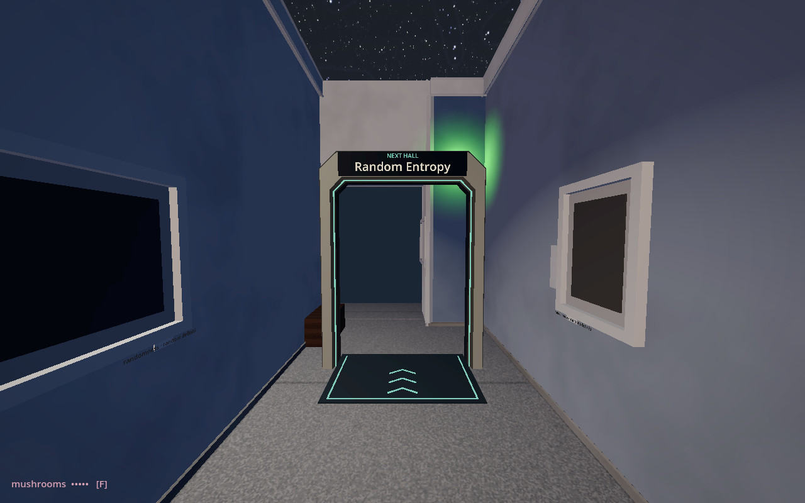
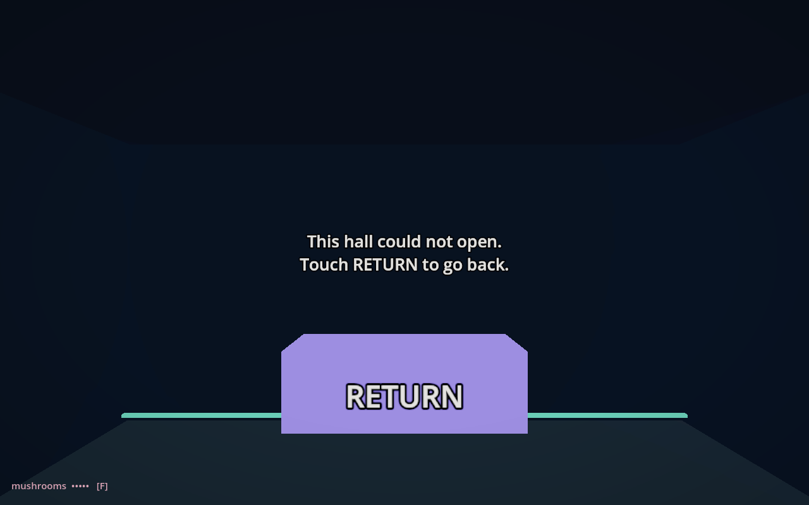

# One hall at a time: Randomness portal pilot

The pilot crosses **Random Definition → Random Entropy**, and back, through an explicit loading chamber. It keeps at most one museum hall instantiated. The old three-shell / one-exhibit streaming remains the default; the pilot is enabled with `--em-portals` in VR.

This is an engine-tested prototype, **not a verified Quest performance fix**. No headset was connected, and no Android APK was rebuilt or deployed.

## The crossing

1. Walk into the mint frame and remain there for 0.3 seconds.
2. The visitor moves into a small chamber whose floor belongs to the persistent coordinator.
3. The previous hall's geometry and artifacts are deleted. The test verifies that its segment node is gone before building another.
4. The destination shell is built; artifact scene resources are requested through Godot's threaded loader. Artifact construction admits one queue item per frame.
5. The queue and floor repairs finish. Physics registers the new floor, and a capsule clearance check confirms a standing place.
6. The visitor arrives with tracked head offset and orientation preserved. Movement controls resume with their previous enabled settings.

The violet frame returns to the previous hall. Arrival does not immediately trigger another crossing: leave the frame before it arms again. End walls prevent walking straight into unloaded space.



The revised portal uses a chamfered enamel face over a dark metal frame, a narrow recessed light, an integrated destination plaque and a flush directional floor inlay. Mint marks forward travel; violet marks return. The frame is opaque static geometry with no new lights, render textures, particles or animation. The walking opening is 1.72 m wide, and the frame-clearance query covers the new profile. The earlier appearance is retained in `definition-portal-before.png`.

These are desktop Mobile-renderer captures of the actual Godot museum, with a synthetic tracked camera. They are not headset photographs. The doorway remains part of the existing hall architecture in this pilot; existing map layouts and book texts have not been shortened or rewritten.

## A failed destination stays outside the visitor's space

If an exhibit fails to load/place, construction times out, or the landing has no support, the visitor remains on the loading chamber floor. A reachable **RETURN** button rebuilds the previous hall; touch it with a tracked controller. `B` is a keyboard fallback for remote testing.



The floor in this screenshot is real collision geometry. The test intentionally refused destination support, touched RETURN through the controller proximity code, and arrived back in Random Definition.

## What survives unloading

Seed Replay implements two small hooks: `capture_museum_state()` and `restore_museum_state()`. They preserve the chosen seed, extra-draw setting, action caption, and the local generator state used by the next RANDOM press. The test compares all sample colours and the subsequent random result after returning.

State is retained in memory for this museum visit. Other artifacts currently restart from their authored configuration unless they implement the same hooks. Moving rigid bodies and arbitrary script internals are not serialized. This is a specific preservation contract, not a claim that every experiment already resumes.

## Validation

The probe uses the real XRTools PlayerBody, its teleport function, collision geometry, physics loop, and movement-provider groups, with a synthetic room-scale head offset. It checks:

- At most one hall, including a zero-hall interval in the supported loading cell.
- A floor beneath the visitor throughout loading.
- Forward and backward sequence order; duplicate requests rejected.
- Seed settings, displayed samples, and the next local random draw restored.
- Failure recovery through a controller touching the actual RETURN button.
- Movement restored without enabling providers that were originally disabled.
- Walking into the frame triggers travel; arrival does not bounce back.
- An unobstructed head can see the loading room, while leaning through a real wall still fades the view.

The rendered probe passes: see `render-result.json` and `render.log`. The headless probe records `result.json`. The previous projectile-cleanup, museum-lighting, and three-shell streaming checks also pass separately, keeping the non-pilot route covered.

Two real integration issues emerged during testing. Teleporting only by the old body-to-origin offset could place the physics body below the floor; the pilot now places both body and tracking origin at the supported landing. XRTools also interpreted a stationary, non-colliding head cast as an obstruction and accumulated opacity beyond one. Its head-collision check now handles that empty cast and bounds opacity. A real wall still triggers the fade.

The delayed plain-hands callback also now accepts and rejects a freed artifact safely, because a portal may unload it before its timer fires.

XRTools is an installed addon excluded by this repository's `.gitignore`. Its two local corrections are also preserved in the tracked `tools/patch_xrtools_head_fade.py` installer. After replacing/updating the addon, run it with `--check`, or `--apply` to reapply the reviewed changes. It refuses unfamiliar source rather than guessing. The fixes are already installed in this workspace.

## The performance boundary

The rendered desktop run measured **215–346 ms for individual synchronous shell builds**. That remains a frame stall. Threaded resource loading does not make a scene's `_ready()` or the procedural shell builder asynchronous. One expensive artifact can still exceed the frame budget, even with one queue item per frame.

The change limits live hall geometry and scripts and moves construction into an explicit transition. It does not prove a particular Quest frame rate or GPU-memory reduction: shared resources, engine caches and driver allocations are not measured by counting scene nodes. The synthetic camera cannot measure headset comfort, reprojection or controller tracking.

The test environment also reports an existing unresolved resource UID/certificate-store warning and, in rendered runs, shader-cache write errors. No GDScript errors remain in the passing pilot run. These logs are retained rather than called a clean device run.

The next performance work is to split shell construction and the heaviest artifact constructors into bounded batches, then collect CPU/GPU frame times on the actual headset. The earlier per-artifact audit is in `../randomness-performance-2026-09-16/README.md`.

## Running it

Connect Quest Link or Air Link, run the project launcher with the pilot flag, then choose Randomness in the museum menu:

```powershell
& 'C:\Users\palle\Documents\GitHub\AdaResearch_46\tools\run_quest_link.ps1' -PortalPilot
```

The launcher starts PC VR using the Mobile renderer. Omitting `-PortalPilot` retains the current streaming route. A dry run prints the executable and arguments without starting the game:

```powershell
& 'C:\Users\palle\Documents\GitHub\AdaResearch_46\tools\run_quest_link.ps1' -PortalPilot -DryRun
```

Automated local reproduction:

```powershell
python doc/space/randomness-portals-2026-09-16/run.py
python doc/space/randomness-portals-2026-09-16/run.py --screenshots
```

## Extending it without flattening the museum

The coordinator uses the existing curriculum cursor and fresh hall rebuilds; it does not replace the spine with a second list. Map authors can retain their compositions while their entrances and exits become explicit transitions.

The automatically selected portal positions have only been exercised in the two ground-level pilot halls. Raised or irregular maps should gain authored portal/landing anchors before this is enabled across the spine. Removing the compulsory seam rooms is a subsequent layout change, to be reviewed against each map's intended entrance rather than done globally in this performance patch.
